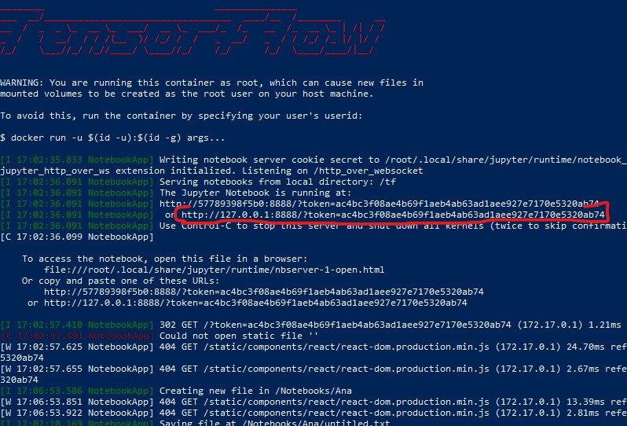

# SAC_DM_Docker
Repository created to keep all the content developed in the SAC-DM studies, using the container tecnology as common enviroment.

# Instruções para uso
1. Baixe o o código desse repositório acesse a pasta em que se encontra o Dockerfile
2. Execute o Build da imagem com o comando `docker build . -t sacdm:1.0`
Aguarde um momento enquanto o Docker realiza o Build, pode demorar alguns minutos.
3. Após o build ser realizado com sucesso, escolha a pasta que será usada como destino para salvar os arquivos finais, ou que precisaram ser acessados durante a execução dos códigos.

3. Copie o caminho da sua `PastaDestino` e substitua no comando a seguir sem os simbolos de <>

`docker run -it -p 8888:8888 -v <PastaDestino>:/tf/Notebooks --name sacdm sacdm:1.0`

Exemplo de caminho no windows:

`docker run -it -p 8888:8888 -v C:/Users/moises/Documents/Mestrado/Scripts:/tf/Notebooks --name sacdm sacdm:1.0`

Ao executar o comando acima com sucesso, no terminal será impresso o token pra desbloquear o Jupyter e um link para acessar já inserindo o token de ativação que poderá ser copiada e colodo na barra de endereço do navegador que desejar.

4. Ao acessar o link como o demonstrado na imagem, o jupyter estará pronto para uso.
## Observações
**ATENÇÃO** O modo iterativo (`-it` no comando run) só é necessário na primeira vez, e ao fechar o terminal ou reiniciar o computador, o container irá parar. Para iniciar novamente basta usar o comando 

`docker start sacdm`

Após o comando Start o container irá funcionar em modo desanexado, rodando como processo em background, portanto não irá para ao fechar o terminal. Caso deseje parar o container basta executar o comando

`docker stop sacdm`

Todos os arquivos criados gerados são salvos automaticamente na pasta destino no momento do run do container, e caso o container seja apagado, os arquivos não serão apagados juntos e poderam ser acessados pelo gerenciador de arquivos da máquina Host normalmente.

## ATENÇÃO!
Para habilitar o tensorflow com GPU no docker é necessário primeiro configurar os drivers da NVIDIA para containers e atualizar o WSL no windows.
E para a execução do container é necessário ativar a flag de GPUS
ex: `docker run -d -p 8888:8888 --gpus all -v C:/Users/moises/Documents/Mestrado/Scripts:/tf/Notebook --name sacdm sacdm:1.0`
